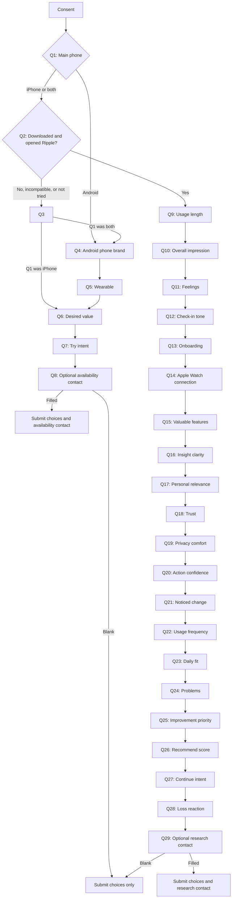

# Ripple User Experience Survey — question flow

All visible survey copy is in English. Core answers use radio buttons,
checkboxes, or a 0–10 scale. Selected questions include an `Other` option that
opens a required short-answer field. The contact detail field at the end of
either route remains optional and may be left blank.

## Entry and consent

Respondents must accept: “I agree that Ripple may use my answers to improve the
product. Any contact detail I choose to provide will only be used for the
purpose shown in the survey.” The page also asks respondents not to enter health
or other sensitive details.

## Access and availability route

1. **Which phone do you mainly use?**
   - iPhone → Q2
   - Android phone → Q4
   - Both iPhone and Android → Q2
2. **Were you able to download and open Ripple from the Apple App Store?**
   - Yes — I downloaded and opened Ripple → Product experience Q9
   - I found it, but could not download or open it → Q3
   - My iPhone, iOS version or watch setup is not compatible → Q3
   - I have not tried to download it yet → Q3
3. **What is stopping you from using Ripple today?**
   - I mainly use Android
   - I do not use an Apple Watch
   - My iPhone cannot run the required iOS version
   - The App Store page or app is unavailable in my region
   - I had a technical problem downloading or opening it
   - I have not had time to try it yet
   - Another reason → required short-answer field
   - Next depends on Q1: both-device users → Q4; iPhone users → Q6
4. **Which Android phone do you use most often?**
   - Samsung Galaxy / Google Pixel / Xiaomi, Redmi or POCO
   - OPPO, OnePlus or realme / Huawei or Honor / Motorola
   - Another Android brand → required short-answer field
   - I am not sure
   - Next → Q5
5. **Which smartwatch or fitness tracker do you use most often?**
   - Samsung Galaxy Watch / Pixel Watch or Fitbit / Garmin
   - Huawei or Honor wearable / Xiaomi wearable / Apple Watch
   - Another wearable → required short-answer field
   - I do not use a smartwatch or fitness tracker
   - Next → Q6
6. **What would make Ripple useful to you?** Choose all that apply.
   - Learning what is normal for my own body
   - Noticing changes and speaking up before I check
   - Clear AI explanations with supporting evidence
   - Connecting sleep, activity and other signals across my day
   - Support for my current watch or fitness tracker
   - Strong privacy and control over my data
   - Something else → required short-answer field
   - I am not sure yet (exclusive)
   - Next → Q7
7. **How likely would you be to try Ripple if it supported your device?**
   - Very likely / Likely / Not sure / Unlikely / Very unlikely
   - Next → Q8
8. **Would you like us to contact you when Ripple becomes available for Android or your device?**
   - Enter any contact detail → submit choices plus contact with purpose `device_availability`
   - Leave blank → submit choices only

## Product experience route

9. **How many days have you used Ripple during this four-day trial?**
   - This is my first day / 2 days / 3 days / All 4 days
10. **What is your overall impression of Ripple so far?**
    - Very positive / Positive / Neutral / Negative / Very negative
11. **How does using Ripple usually make you feel?** Choose all that apply.
    - Reassured / More informed / More in control / Motivated / Curious
    - Anxious / Overwhelmed
    - Another feeling → required short-answer field
    - No strong feeling (exclusive)
12. **How do Ripple’s check-ins feel?**
    - Very supportive / Mostly supportive / Neutral
    - Sometimes intrusive / Too intrusive / Not enough check-ins yet
13. **How easy was it to get started?**
    - Very easy / Easy / Neither easy nor difficult / Difficult / Very difficult
14. **Were you able to connect Apple Watch health data?**
    - Yes, smoothly / Yes, with difficulty / Not yet / Unable / No Apple Watch
15. **Which parts of Ripple have felt valuable so far?** Choose all that apply.
    - Personal baseline / AI explanations and evidence
    - Proactive check-ins or notifications / Daily overview
    - Charts and trends / Privacy and control
    - Something else → required short-answer field
    - Nothing has felt valuable yet (exclusive)
16. **How clear are Ripple’s explanations and insights?**
    - Very clear / Clear / Sometimes clear, sometimes confusing
    - Confusing / Very confusing / Not enough insights yet
17. **How personal and relevant do Ripple’s insights feel?**
    - Very personal and relevant / Mostly relevant / Mixed
    - Mostly generic / Not relevant / Not enough insights yet
18. **How much do you trust Ripple’s interpretation of your wellness data?**
    - A lot / Quite a bit / Somewhat / Very little / Not at all / Too early to judge
19. **How comfortable do you feel with the way Ripple handles your wellness data?**
    - Very comfortable / Comfortable / Neutral / Uncomfortable
    - Very uncomfortable / I need more information
20. **How confident do you feel acting on Ripple’s suggestions?**
    - Very confident / Confident / Somewhat confident / Not very confident
    - I would not act on them / Not enough suggestions yet
21. **Has Ripple helped you notice or understand a change you might otherwise have missed?**
    - Yes, and I changed something / Yes, it helped me understand
    - Not yet / Too early to tell
22. **During this four-day trial, how often have you opened or acted on Ripple?**
    - Only once / A few times in total / About once a day
    - Several times a day / Only when notified / I am not sure
23. **How well does Ripple fit into your daily routine?**
    - Very well / Fairly well / Somewhat / Poorly / Not at all / Too early to tell
24. **Which problems have you experienced?** Choose all that apply.
    - Sign-in/account setup / Health permissions / Apple Watch or health-data sync
    - Slow loading / Unclear or unhelpful explanation / Notification timing
    - Navigation / Crash, freeze or technical bug
    - Another problem → required short-answer field
    - None of these (exclusive)
25. **What should we improve first?**
    - Reliability and sync / Clearer explanations / Speed / Next-step suggestions
    - Charts and trends / Notification controls / Privacy explanations
    - Something else → required short-answer field
    - Nothing major
26. **How likely are you to recommend Ripple to someone who uses an Apple Watch?**
    - 0 (not at all likely) through 10 (extremely likely)
27. **How likely are you to keep using Ripple over the next month?**
    - Definitely will / Probably will / Not sure / Probably will not / Definitely will not
28. **How would you feel if Ripple were no longer available?**
    - Very disappointed / Somewhat disappointed / Not disappointed
    - I no longer use Ripple / Too early to say
29. **Would you be open to a short follow-up about your Ripple experience?**
    - Enter any contact detail → submit choices plus contact with purpose `research_followup`
    - Leave blank → submit choices only

Questions Q9–Q29 follow the order shown above. Only the initial access questions
branch. Contact details are excluded from the public answer object and included
only in the private `contact` payload when the respondent enters a value.
Conditional `Other` responses are stored next to their question using an
`_other_text` answer key and are limited to 160 characters.

## Complete route map

