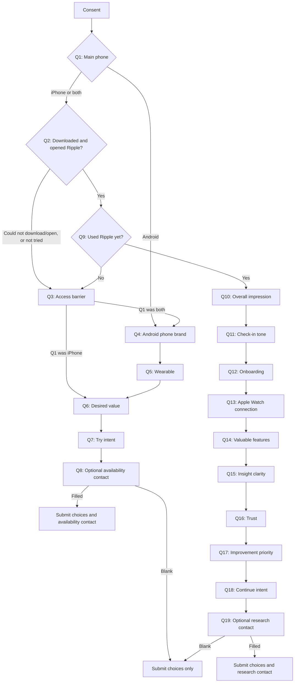

# Ripple User Experience Survey — question flow

All visible survey copy is in English. Core answers use radio buttons or
checkboxes. Selected questions include an `Other` option that opens a required
short-answer field. The contact detail field at the end of either route is
optional and may be left blank.

The longest route for someone who has used Ripple is **13 visible questions**,
including the final optional contact question.

## Entry and consent

Respondents must accept: “I agree that Ripple may use my answers to improve the
product. Any contact detail I choose to provide will only be used for the
purpose shown in the survey.” The page also asks respondents not to enter health
or other sensitive details.

## Access and availability route

1. **Which phone do you mainly use?**
   - iPhone → Q2
   - Android phone → Q4
   - Both iPhone and Android → Q2
2. **Were you able to download and open Ripple from the Apple App Store?**
   - Yes — I downloaded and opened Ripple → Q9
   - I found it, but could not download or open it → Q3
   - I have not tried to download it yet → Q3
3. **What is stopping you from using Ripple today?**
   - I mainly use Android
   - I do not use an Apple Watch
   - My iPhone cannot run the required iOS version
   - The App Store page or app is unavailable in my region
   - I had a technical problem downloading or opening it
   - I have not had time to try it yet
   - Another reason → required short-answer field
   - Next depends on Q1: both-device users → Q4; iPhone users → Q6
4. **Which Android phone do you use most often?**
   - Samsung Galaxy / Google Pixel / Xiaomi, Redmi or POCO
   - OPPO, OnePlus or realme / Huawei or Honor / Motorola
   - Another Android brand → required short-answer field
   - I am not sure
   - Next → Q5
5. **Which smartwatch or fitness tracker do you use most often?**
   - Samsung Galaxy Watch / Pixel Watch or Fitbit / Garmin
   - Huawei or Honor wearable / Xiaomi wearable / Apple Watch
   - Another wearable → required short-answer field
   - I do not use a smartwatch or fitness tracker
   - Next → Q6
6. **What would make Ripple useful to you?** Choose all that apply.
   - Learning what is normal for my own body
   - Noticing changes and speaking up before I check
   - Clear AI explanations with supporting evidence
   - Connecting sleep, activity and other signals across my day
   - Support for my current watch or fitness tracker
   - Strong privacy and control over my data
   - Something else → required short-answer field
   - I am not sure yet (exclusive)
   - Next → Q7
7. **How likely would you be to try Ripple if it supported your device?**
   - Very likely / Likely / Not sure / Unlikely / Very unlikely
   - Next → Q8
8. **Would you like us to contact you when Ripple becomes available for Android or your device?**
   - Enter any contact detail → submit choices plus contact with purpose `device_availability`
   - Leave blank → submit choices only

## Product experience route

9. **Have you used Ripple yet?**
   - Yes — I have used Ripple → Q10
   - No — not yet → Q3, then the access and availability route
10. **What is your overall impression of Ripple so far?**
    - Very positive / Positive / Neutral / Negative / Very negative
11. **How do Ripple’s check-ins feel?**
    - Very supportive / Mostly supportive / Neutral
    - Sometimes intrusive / Too intrusive / Not enough check-ins yet
12. **How easy was it to get started?**
    - Very easy / Easy / Neither easy nor difficult / Difficult / Very difficult
13. **Were you able to connect Apple Watch health data?**
    - Yes, smoothly / Yes, with difficulty / Not yet / Unable / No Apple Watch
14. **Which parts of Ripple have felt valuable so far?** Choose all that apply.
    - Personal baseline / AI explanations and evidence
    - Proactive check-ins or notifications / Daily overview
    - Charts and trends / Privacy and control
    - Something else → required short-answer field
    - Nothing has felt valuable yet (exclusive)
15. **How clear are Ripple’s explanations and insights?**
    - Very clear / Clear / Sometimes clear, sometimes confusing
    - Confusing / Very confusing / Not enough insights yet
16. **How much do you trust Ripple’s interpretation of your wellness data?**
    - A lot / Quite a bit / Somewhat / Very little / Not at all / Too early to judge
17. **What should we improve first?**
    - Reliability and sync / Clearer explanations / Speed / Next-step suggestions
    - Charts and trends / Notification controls / Privacy explanations
    - Something else → required short-answer field
    - Nothing major
18. **How likely are you to keep using Ripple over the next month?**
    - Definitely will / Probably will / Not sure / Probably will not / Definitely will not
19. **Would you be open to a short follow-up about your Ripple experience?**
    - Enter any contact detail → submit choices plus contact with purpose `research_followup`
    - Leave blank → submit choices only

Questions Q10–Q19 are shown only when Q9 is `Yes — I have used Ripple`.
Together with Q1, Q2 and Q9, this route contains exactly 13 visible questions.
Respondents who answer No at Q9 skip all experience questions and return to the
access and availability route. Contact details are excluded from the public
answer object and included only in the private `contact` payload when entered.
Conditional `Other` responses are stored next to their question using an
`_other_text` answer key and are limited to 160 characters.

## Complete route map

