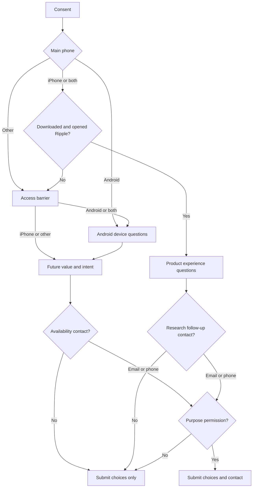

# Ripple User Experience Survey — question flow

All visible survey copy is in English. Every experience question uses radio
buttons, checkboxes, or a 0–10 scale. The only free-text field is the optional
email address or phone number.

## Entry and consent

Respondents must accept: “I agree that Ripple may use my answers to improve the
product. Any contact detail I choose to provide will only be used for the
purpose shown in the survey.” The page also asks respondents not to enter health
or other sensitive details.

## Access questions

1. **Which phone do you mainly use?**
   - iPhone → Q2
   - Android phone → Q4
   - Both iPhone and Android → Q2
   - Another phone or no smartphone → Q3
2. **Were you able to download and open Ripple from the Apple App Store?**
   - Yes — I downloaded and opened Ripple → Product experience Q9
   - I found it, but could not download or open it → Q3
   - My iPhone, iOS version or watch setup is not compatible → Q3
   - I have not tried to download it yet → Q3
3. **What is stopping you from using Ripple today?**
   - I mainly use Android
   - I do not use an Apple Watch
   - My iPhone cannot run the required iOS version
   - The App Store page or app is unavailable in my region
   - I had a technical problem downloading or opening it
   - I have not had time to try it yet
   - Another reason
   - Next: Android/both users → Q4; iPhone/other users → Q6
4. **Which Android phone do you use most often?**
   - Samsung Galaxy
   - Google Pixel
   - Xiaomi, Redmi or POCO
   - OPPO, OnePlus or realme
   - Huawei or Honor
   - Motorola
   - Another Android brand
   - I am not sure
   - Next → Q5
5. **Which smartwatch or fitness tracker do you use most often?**
   - Samsung Galaxy Watch
   - Pixel Watch or Fitbit
   - Garmin
   - Huawei or Honor wearable
   - Xiaomi wearable
   - Apple Watch
   - Another wearable
   - I do not use a smartwatch or fitness tracker
   - Next → Q6
6. **What would make Ripple useful to you?** Choose all that apply.
   - Learning what is normal for my own body
   - Noticing changes and speaking up before I check
   - Clear AI explanations with supporting evidence
   - Connecting sleep, activity and other signals across my day
   - Support for my current watch or fitness tracker
   - Strong privacy and control over my data
   - I am not sure yet (exclusive)
   - Next → Q7
7. **How likely would you be to try Ripple if it supported your device?**
   - Very likely / Likely / Not sure / Unlikely / Very unlikely
   - Next → Q8
8. **Would you like us to contact you when Ripple becomes available for Android or your device?**
   - Yes — contact me by email → Email → Contact permission
   - Yes — contact me by phone → Phone → Contact permission
   - No, I do not want an availability update → Submit without contact

## Product experience questions

9. **How long have you been using Ripple?**
   - First time today / 2–7 days / 1–4 weeks / More than one month
10. **What is your overall impression of Ripple so far?**
    - Very positive / Positive / Neutral / Negative / Very negative
11. **How easy was it to get started?**
    - Very easy / Easy / Neither easy nor difficult / Difficult / Very difficult
12. **Were you able to connect Apple Watch health data?**
    - Yes, smoothly / Yes, with difficulty / Not yet / Unable / No Apple Watch
13. **Which parts of Ripple have felt valuable so far?** Choose all that apply.
    - Personal baseline
    - AI explanations and evidence
    - Proactive check-ins or notifications
    - Daily overview
    - Charts and trends
    - Privacy and control
    - Nothing has felt valuable yet (exclusive)
14. **How clear are Ripple’s explanations and insights?**
    - Very clear / Clear / Sometimes clear, sometimes confusing / Confusing /
      Very confusing / Not enough insights yet
15. **How much do you trust Ripple’s interpretation of your wellness data?**
    - A lot / Quite a bit / Somewhat / Very little / Not at all / Too early to judge
16. **Has Ripple helped you notice or understand a change you might otherwise have missed?**
    - Yes, and I changed something / Yes, it helped me understand / Not yet /
      Too early to tell
17. **How often do you currently open or act on Ripple?**
    - Several times a day / About once a day / A few times a week / Less than
      once a week / Only when notified / I have stopped using it
18. **Which problems have you experienced?** Choose all that apply.
    - Sign-in/account setup
    - Health permissions
    - Apple Watch or health-data sync
    - Slow loading
    - Unclear or unhelpful explanation
    - Notification timing or volume
    - Navigation
    - Crash, freeze or technical bug
    - None of these (exclusive)
19. **What should we improve first?**
    - Reliability and sync / Clearer explanations / Speed / Next-step suggestions /
      Charts and trends / Notification controls / Privacy explanations / Nothing major
20. **How likely are you to recommend Ripple to someone who uses an Apple Watch?**
    - 0 (not at all likely) through 10 (extremely likely)
21. **How likely are you to keep using Ripple over the next month?**
    - Definitely will / Probably will / Not sure / Probably will not / Definitely will not
22. **May we contact you for a short follow-up about your Ripple experience?**
    - Yes — email → Email → Contact permission
    - Yes — phone → Phone → Contact permission
    - No follow-up → Submit without contact

## Contact permission

After an email or phone number is entered, the respondent must answer:
**“May Ripple use this contact detail for the purpose you selected?”**

- Yes, I agree → submit the contact with purpose `device_availability` or
  `research_followup`.
- No, submit my answers without contact details → delete the contact from the
  payload, then submit the choice answers only.

## Compact route map

